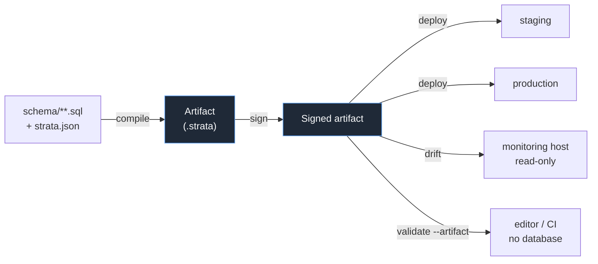
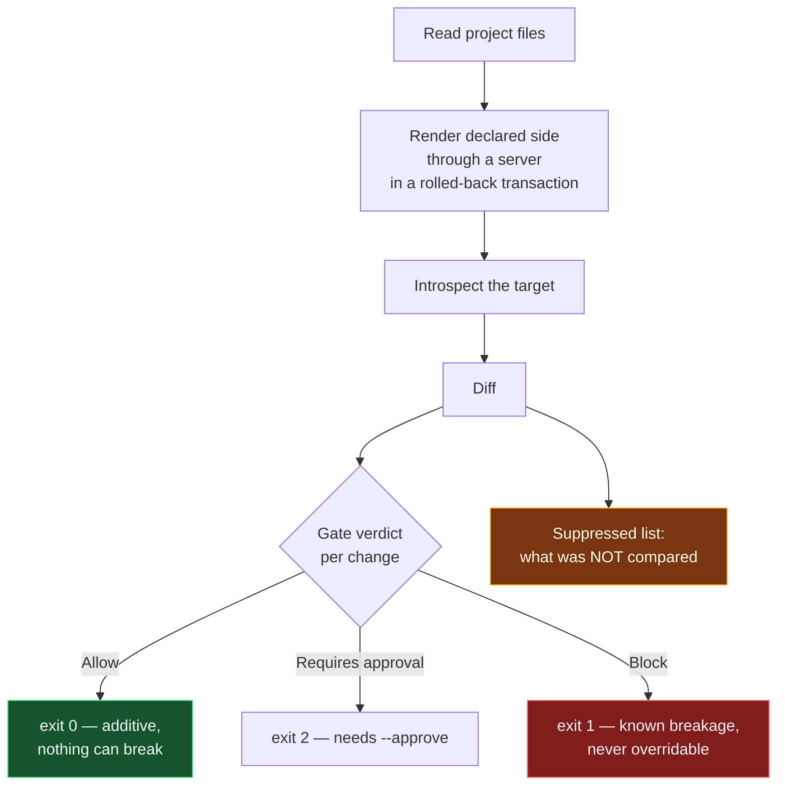

# Strata

Declarative schema management for PostgreSQL, built so that **"I could not check
that" is never rendered the same way as "that is fine."**

You write your schema as ordinary `.sql` files. Strata compiles them into an
artifact, diffs that artifact against a live database, judges each change for
what it would break, and applies the ones you allow.

```
schema/app/tables/customer.sql   ──compile──▶  app.strata  ──deploy──▶  your database
```

> **Status: pilot.** Developed and tested against PostgreSQL 16; other majors are
> untested, and `deploy` refuses a target whose major differs from the compiling
> server. It is exercised end to end, but it
> has not been run against a large real migration history. See
> [What is measured, and what is not](#what-is-measured-and-what-is-not) — that
> section is deliberately unflattering.

---

## Contents

- [Why this exists](#why-this-exists)
- [Install and build](#install-and-build)
- [Quick start](#quick-start)
- [How it fits together](#how-it-fits-together)
- [The project layout](#the-project-layout)
- [Worked examples](#worked-examples)
- [What Strata compares, and what it only reports](#what-strata-compares-and-what-it-only-reports)
- [Command reference](#command-reference)
- [For agents](#for-agents)
- [What is measured, and what is not](#what-is-measured-and-what-is-not)
- [How this repository is run](#how-this-repository-is-run)

---

## Why this exists

Most schema tools answer "is the database the same as my files?" with **yes** or
**no**. The interesting third answer — *"I did not look"* — usually renders as
**yes**.

That is not hypothetical. During development, five separate defects were found
where Strata itself reported a clean diff for a difference it had simply never
compared: a view whose `AS` was followed by a newline, a view with a column-alias
list, a generated column, a policy expression, a domain over a changed base type.
Each looked exactly like convergence.

So the central rule is that these are **six different states**, never collapsed:

| State | Meaning |
|---|---|
| `matches` | Compared, and the same |
| `differs` | Compared, and not the same |
| `not-compared` | Strata looked and could not compare it — **says so** |
| `not-modelled` | Exists, but Strata does not model this kind of thing |
| `unverifiable` | Could not be determined — **not a pass** |
| `absent` | Not there at all |

A plan that says `0 changes` will also tell you what it did not compare. That
footnote is the product.

---

## Install and build

Requires **.NET 8** and, for anything touching a database, **PostgreSQL 16**.

```bash
git clone https://github.com/kemiller2002/strata
cd strata
./scripts/build.sh                 # Release build (plain `dotnet build` gives you Debug)

# Run it
dotnet run --project src/Strata.Cli -c Release --no-build -- --help
```

For the live integration tests:

```bash
./scripts/test-fixture.sh          # creates the strata_test database, prints a connection string
STRATA_TEST_PG="Host=localhost;Port=5432;Database=strata_test;Username=strata;Password=strata_local_test" \
  dotnet test Strata.sln -c Release
```

Without `STRATA_TEST_PG`, the live tests **skip** rather than fail — a green run
with 35 skips is not the same as a green run, so check the skip count.

A shell alias makes the examples below readable:

```bash
alias strata='dotnet run --project src/Strata.Cli -c Release --no-build --'
export STRATA_PG="Host=localhost;Port=5432;Database=shop;Username=app;Password=..."
```

---

## Quick start

### 1. Write your schema as files

```bash
mkdir -p shop/schema/app/{tables,views}
```

```sql
-- shop/schema/app/tables/customer.sql
CREATE TABLE app.customer (
    id      bigint PRIMARY KEY,
    email   text NOT NULL UNIQUE,
    status  text NOT NULL DEFAULT 'active',
    CONSTRAINT customer_status_known CHECK (status IN ('active', 'closed'))
);
```

```sql
-- shop/schema/app/views/active_customer.sql
CREATE VIEW app.active_customer AS
    SELECT id, email FROM app.customer WHERE status = 'active';
```

### 2. Create the manifest

```bash
strata init --project shop --from-tree
```

```
Wrote shop/strata.json with 2 object file(s):
  schema/app/tables/customer.sql
  schema/app/views/active_customer.sql

Read it. From here on a .sql file this does not list FAILS the build, which is
the point: a directory walk cannot notice that a file was added.
```

### 3. See what would happen

```bash
strata plan --project shop
```

```
PLAN: 2 change(s), 2 suppressed  —  gate verdict ALLOW

  create-table       app.customer
  create-view        app.active_customer

NOT PROPOSED — differences Strata saw and will not act on:

  public                       [not-modelled]
      PUBLIC holds privileges here and the project declares none for them, so
      they were NOT compared and nothing is revoked: PUBLIC=USAGE
  plpgsql                      [not-modelled]
      extension plpgsql is installed and the project does not declare it; an
      extension is never dropped because DROP EXTENSION takes every object it
      owns (version 1.0)

  [ALLOW] creates app.customer
         why:  Additive. Creates a new object.
         next: Proceed.
```

Those two suppressions appear on **every** fresh PostgreSQL database — `PUBLIC`
holds `USAGE` on `public`, and `plpgsql` is installed by default. Strata reports
them rather than quietly revoking or dropping either. This is the second list,
and it is the one worth reading.

### 4. Apply it

```bash
strata apply --project shop --confirm
```

```
  ok      CREATE TABLE app.customer (...)
  ok      CREATE VIEW app.active_customer AS ...

Applied 2 statement(s).
```

### 5. Confirm convergence

```bash
strata plan --project shop
```

```
PLAN: 0 change(s), 2 suppressed  —  gate verdict REQUIRES-APPROVAL
  (no changes proposed)

Database already matches desired state; nothing to apply.
```

```bash
echo $?     # 0
```

Note the verdict says `REQUIRES-APPROVAL` while the exit code is **0**. That is
not a contradiction: the verdict describes the changes the gate *would* judge,
and there are none. An empty plan from a diff is convergence. **Read the change
count, not the verdict.**

---

## How it fits together

### The compile / deploy split

The key design decision ([`DF-STRATA-2026-2F6B`](research/decisions)) is that
**half of a deployment can be computed without the target, and half cannot.**

Rendering what your files *mean* — what `DEFAULT 'open'` becomes, what a view's
text normalises to, what a `CHECK` expression looks like once PostgreSQL has
parsed it — depends only on your source and on *a* PostgreSQL. That half
compiles. The change list depends on what the target holds right now. That half
cannot.



The same bytes go to staging and production, so *"what we tested is what we
shipped"* is a fact about the input rather than a claim about a process.

An artifact **carries no fact about any database**
([`DF-STRATA-2026-9A41`](research/decisions)). That rule exists because the first
version broke it: an artifact compiled against a populated database, deployed to
an empty one, applied 4 statements instead of 6, exited 0, and left a lookup
table empty.

### What a plan does



`--approve` accepts *requires-approval* findings and restates each one as
approved in the output. It **never** overrides a block, and it does not enable
removals — those need `--allow-drops` as well.

### Shadow normalisation — how the declared side is compared at all

A file says `DEFAULT 'open'`. The catalog says `'open'::text`. A file says
`CHECK (balance >= 0)`. The catalog says `CHECK ((balance >= (0)::numeric))`.
Comparing the two texts reports a difference on every run, forever.

The only thing that can normalise PostgreSQL DDL faithfully is PostgreSQL. So
the declared DDL is executed in a throwaway schema inside a transaction that is
**always rolled back** — on success and on failure alike — and read back through
the same catalog functions the real object is read through.

```mermaid
sequenceDiagram
    participant F as Your .sql file
    participant S as Shadow schema
    participant C as pg_catalog
    participant D as Diff

    F->>S: BEGIN; CREATE SCHEMA shadow_a1b2;
    F->>S: CREATE TABLE shadow_a1b2.t_9f (...)
    S->>C: pg_get_expr / pg_get_constraintdef
    C-->>D: "'open'::text"
    Note over S: ROLLBACK — always
    D->>D: compare against the target's<br/>own rendering of the same thing
```

`plan` therefore stays effectively read-only: it writes only what it immediately
discards. If the role cannot create a schema, normalisation returns nothing and
the affected objects are reported **not-compared** rather than guessed at.

---

## The project layout

```
shop/
├── strata.json
└── schema/
    └── app/                 ← the directory name IS the schema name
        ├── tables/customer.sql
        ├── views/active_customer.sql
        ├── routines/touch.sql
        ├── indexes/customer_email.sql
        ├── triggers/customer_audit.sql
        ├── sequences/order_no.sql
        ├── types/order_status.sql
        ├── policies/customer_tenant.sql
        ├── extensions/citext.sql
        ├── grants/customer.sql
        └── data/country.sql          ← reference rows
```

One object per file. The `kind` directory names are yours to choose.

`strata.json` is **required** and lists every file explicitly:

```json
{
  "include": [
    "schema/app/tables/customer.sql",
    "schema/app/views/active_customer.sql",
    "schema/app/grants/customer.sql"
  ],
  "invariants": ["everyTableHasAPrimaryKey", "noGrantsToPublic"]
}
```

**No globs.** `"schema/**/*.sql"` is a directory walk wearing a manifest's
clothes: drop a file in and the build takes it. A `.sql` file under the schema
root that `include` does not list **fails the load**, and so does a listed path
that is not there. Both are errors, and both have a cheap fix — list the file,
or move it out of the tree.

### Declared invariants

Rules the project asserts about *itself*, checked at compile time. All opt-in; a
name this build does not recognise is an **error**, never a silent no-op.

| Invariant | What it catches |
|---|---|
| `everyTableHasAPrimaryKey` | A table with no identity — nothing can reference or de-duplicate its rows |
| `noGrantsToPublic` | `PUBLIC` includes every current *and future* role |
| `everyForeignKeyIsIndexed` | Every delete on the parent scans the child, and locks while it does |

---

## Worked examples

### Validate agent-written SQL before it runs

```bash
strata validate report.sql; echo "exit $?"
```

```
INVALID: report.sql (1 statement(s))

  [invalid] statement 1 at offset 0
         column 'emial' does not exist in any relation in scope

exit 1
```

A file mixing a bad SQL body with a plpgsql one shows both outcomes at once:

```
INVALID: routines.sql (2 statement(s))

  [invalid] statement 1 at offset 0
         in routine body: column 'nonexistent_column' does not exist in any relation in scope

  [unverifiable] statement 2 at offset 130
         routine body parses as plpgsql, but Strata does not resolve references inside plpgsql bodies

NOTE: 'unverifiable' is NOT a pass. Strata could not determine whether these
      references are correct, and says so rather than guessing either way.
```

`LANGUAGE sql` routine bodies are recursed into and resolved. `LANGUAGE plpgsql`
bodies are **syntax-checked only** — a syntax error is reported `invalid`, but
references inside are `unverifiable`.

Add `--types` to have the server `PREPARE` each statement inside a rolled-back
transaction. That catches what a reference check cannot: `WHERE total = 'abc'` on
a numeric column, a function with no such signature, an ambiguous column in a
join.

**With no database at all**, validate against a compiled artifact — usable in an
editor, a pre-commit hook, or a PR from a fork:

```bash
strata validate report.sql --artifact app.strata --search-path app,public
```

This also asks the better question: a query that is valid against the artifact
but fails against production has found a **stale server**, not a bad query.

### Gate a proposed migration in CI

```bash
strata check proposed.sql
echo $?     # 0 allow · 1 block · 2 requires approval
```

```
  [BLOCK] drops column app.customer.email, which 3 source(s) still read
         why:  The data is destroyed and every reader breaks at once.
         affected: reports/customer-totals.sql, reports/invoice-join.sql, migrations/001-add-note.sql
         next: Remove the reads first, in their own reviewed change.
```

### Ship the same bytes to staging and production

```bash
strata keygen --key strata.key --public-key strata.pub

strata compile --project shop --out app.strata
strata sign --artifact app.strata --key strata.key

strata deploy --artifact app.strata --connection "$STAGING"    --confirm \
              --public-key strata.pub --require-signature
strata deploy --artifact app.strata --connection "$PRODUCTION" --confirm \
              --public-key strata.pub --require-signature
```

Every artifact already carries an unkeyed **integrity digest**, which catches an
edited or truncated file. A **signature** is what resists someone who wants to
change it. They are kept as two distinct claims because they answer two different
questions.

`deploy` refuses when the target's PostgreSQL **major** version differs from the
one that compiled the artifact: the expressions inside are the compiling server's
rendering, and deparsing changes between majors.

### Monitor for drift, read-only

```bash
strata drift --artifact app.strata --connection "$PRODUCTION"
echo $?     # 0 matches · 1 differs · 2 could not tell
```

```
NO DRIFT: the target still matches the artifact.
```

Needs only read access, so it runs from a monitoring host that could not deploy
if it tried. Removals count as drift — an object the target has and the artifact
does not is a difference.

### Ask what breaks before you break it

```bash
strata impact app.customer.email --corpus ./sql
```

```bash
strata readers app.customer         # sources that read it
strata writers app.customer         # sources that write it
strata path app.orders app.customer # how two objects relate
strata relationships app.customer   # every relationship touching it
```

### Reference data as desired state

```sql
-- schema/app/data/country.sql
INSERT INTO app.country (code, name) VALUES
    ('GB', 'United Kingdom'),
    ('FR', 'France');
```

Both sides are rendered by the server through the real column types, so `1.250`
in a file and `1.25` in a `numeric(12,2)` column are recognised as the same
value rather than reported as a difference forever.

A row the project does **not** declare is reported and **never** deleted — not
even under `--allow-drops`. A reference row that user data points at cannot be
removed without either failing on a foreign key or cascading into that data.

---

## What Strata compares, and what it only reports

This table is the honest map of coverage. Measured, not aspirational.

| Object | Created | Compared for drift | Notes |
|---|---|---|---|
| Tables, columns | ✅ | ✅ | Defaults and checks via shadow normalisation |
| Constraints | ✅ | ✅ | Unnamed ones matched by **definition**, never a fabricated name |
| Views | ✅ | ✅ | Declared DDL round-tripped through the server |
| **Materialized views** | ✅ | ❌ | **Presence only** — disclosed as not-compared |
| Functions, procedures | ✅ | ✅ | Body text vs `prosrc`, when both sides hold text |
| `BEGIN ATOMIC` / C routines | ✅ | ❌ | No body text to compare — disclosed |
| Indexes, triggers, sequences | ✅ | ✅ | |
| Enum types | ✅ | ✅ | Can add a value at a position; **cannot** remove or reorder |
| Domains | ✅ | ✅ | Base type and collation cannot change at all |
| Grants, column grants | ✅ | ✅ | Per grantee; a grantee you never name is untouched |
| RLS policies | ✅ | ✅ | Never dropped, `--allow-drops` included |
| Extensions | ✅ | ✅ | Installed and updated, **never** dropped |
| Reference rows | ✅ | ✅ | Never deleted |
| Composite / range types | ❌ | ❌ | **Refused by name**, loudly — never silently ignored |

Two things follow from PostgreSQL's own limits rather than from Strata's:

- **Enums**: there is no `ALTER TYPE ... DROP VALUE` at all, and values cannot be
  reordered. A removed or reordered label is reported as a difference Strata will
  not act on, naming what would have to happen instead.
- **Domains**: there is no `ALTER DOMAIN ... TYPE`. A base-type or collation
  difference stops *every other comparison* on that domain, because a domain's
  default and predicates are rendered **through** the base type — while the base
  types differ the two sides can never agree on any of them.

---

## Command reference

| Command | Needs a DB? | Exit codes |
|---|---|---|
| `init` / `add` / `sync` | no | 0 ok |
| `compile --out <file>` | yes (any PG of the right major) | 0 compiled · 1 project wrong · 2 unreadable |
| `keygen` / `sign` | no | 0 ok |
| `plan` | yes | 0 allow *or already matches* · 1 block · 2 approval |
| `apply --confirm` | yes | as `plan` |
| `deploy --artifact` | yes | as `plan` |
| `drift --artifact` | read-only | 0 matches · 1 differs · 2 could not tell |
| `validate <f.sql>` | yes, or `--artifact` | 0 valid · 1 provably wrong · 2 unverifiable |
| `check <f.sql>` | yes | 0 allow · 1 block · 2 approval |
| `scope` | yes | 0 |
| `inspect` / `relationships` / `path` / `impact` / `readers` / `writers` | yes | 0 |

Global flags: `--connection` (or `STRATA_PG`), `--corpus` (or `STRATA_CORPUS`),
`--project`, `--json`, `--brief`, `--allow-drops`, `--approve`, `--confirm`,
`--types`, `--search-path`, `--require-signature`.

**`plan` exits 0 when the database already matches, whatever the gate verdict** —
an empty plan from a diff is convergence, not a problem.

---

## For agents

If you are an LLM agent driving Strata, read
**[`docs/strata/AGENT-GUIDE.md`](docs/strata/AGENT-GUIDE.md)**. It covers the
decision table for when Strata beats `grep` (and when it very much does not),
the `--json --brief` session pattern with measured payload sizes, how to read
every exit code, and a copy-paste system-prompt block.

The one-line version:

```bash
strata scope --json                          # once per session
strata inspect app.customer --json --brief   # every query after that
```

Measured on the `sales` fixture today: a full `inspect` answer is **2,715 bytes**;
`--brief` is **883 bytes** (a 67% cut) and the shared scope block is **2,049
bytes** fetched once. The break-even is the **second query** of a session.

---

## What is measured, and what is not

This project keeps falsifiable hypotheses and evidence records under
[`research/`](research). This section reports what they actually say, including
where they contradict the project's own original motivation.

### Context size: a real win, at scale, against a whole-schema read

[`EV-STRATA-2026-F4C6`](research/evidence/EV-STRATA-2026-F4C6--agent-context-cost.md)

| Schema | Raw context | One Strata answer | Ratio |
|---|---|---|---|
| `sales`, 4 tables | ~1,724 tok/task | ~725 tok/task | **2.4x** |
| `big`, 200 tables | ~57,360 tok | 566–1,258 tok | **46x – 101x** |

Raw context is `O(schema size)`; a Strata point query is `O(1)` in schema size.
The two figures are the same mechanism at different points on one curve.

**Do not quote that headline without these:** the raw condition assumes an agent
reads the *entire* schema, which a competent agent with `grep` would not; the
200-table schema is synthetic and uniform; token counts are estimated at 4
chars/token (byte counts are exact); and a later record found the `inspect`
answers measured were **lossy** — unique constraints, check constraints and
indexes were missing — so the ratios were computed against an incomplete answer.

### Session cost: Strata lost

[`EV-STRATA-2026-D8E1`](research/evidence/EV-STRATA-2026-D8E1--agent-correctness-null-result.md)
— six agents, five questions, 4-table schema:

> **Correctness 15/15 in both conditions. Strata used 8.7% MORE tokens**
> (48,870 vs 44,951 mean).

### At scale with search tools: `grep` won decisively

[`EV-STRATA-2026-D7B2`](research/evidence/EV-STRATA-2026-D7B2--advantage-does-not-survive-scale.md)
— 2.37M-token corpus, both conditions interactive:

> `grep` answered the discriminating question in **15 ms**. Strata took
> **247,000 ms** — about **16,000x slower**. Both raw agents answered all four
> seam questions correctly, including the `SELECT *` case designed to be
> findable only by Strata.

### Messy corpus: no advantage either

[`EV-STRATA-2026-E3D7`](research/evidence/EV-STRATA-2026-E3D7--messy-corpus-no-advantage.md)
— unqualified names, shadowing, cross-schema collisions, dynamic SQL: both
conditions scored 6/6 recall and 6/6 precision, identical to Strata.

### Honest summary of the agent thesis

**The correctness hypothesis has been tested in four regimes — small clean, small
seam, large clean, small messy — and has held in none.** The token-reduction
hypothesis is supported *only* for large schemas with targeted single queries,
and is **actively false** for small schemas with multi-query sessions. Neither
experiment located the crossover.

If you are adopting Strata to cut agent token spend, **the evidence does not
currently support that**, and you should measure it on your own schema first.

### What *is* established

- **The gate is deterministic**
  ([`EV-STRATA-2026-F8A2`](research/evidence/EV-STRATA-2026-F8A2--deployment-gate.md)):
  9/9 correct on a nine-case matrix, **byte-identical across three runs**, correct
  CI exit codes, no agent in the loop. A pipeline cannot block on a probabilistic
  answer; there is nothing to diff or assert on. Its *value* versus existing
  migration tooling is **not** established — no baseline comparison has been run,
  and the abstention rate on real migrations is unmeasured.
- **Artifacts are byte-stable.** Two compiles of one source produce identical
  bytes, which is what makes signing meaningful.
- **The false-clean class is real and was caught.** The five defects listed in
  [Why this exists](#why-this-exists) were each a difference that was never
  compared, rendering as convergence. They were found by a corpus harness that
  **fails a fixture if it declares an object Strata did not compare** — an empty
  change list is not accepted as a pass on its own.

### Cost of building it

Development telemetry lives in `.ros/telemetry/`. It records what building Strata
cost, which is a different question from what using it saves, and the two should
not be quoted as if they were the same number.

---

## How this repository is run

This repo is also a pilot of **Repository Operating System 2.0.1**. Work items,
decisions, hypotheses and evidence are tracked as records rather than prose.

- [`AGENTS.md`](AGENTS.md) — the canonical agent contract for working *on* this repo
- [`BOOTSTRAP.md`](BOOTSTRAP.md) — setup
- [`docs/development-telemetry.md`](docs/development-telemetry.md) — telemetry rules
- [`research/`](research) — hypotheses, experiments, evidence, decisions

```bash
./ros validate            # work-item attribution and record integrity
./ros registry check
scripts/ros-validate.sh   # what CI runs — use this, not ./ros validate alone
```

> **Pilot rule.** The operating system is itself under evaluation. Do not infer
> that Strata is a validated method or product merely because the repository
> follows a rigorous process.
